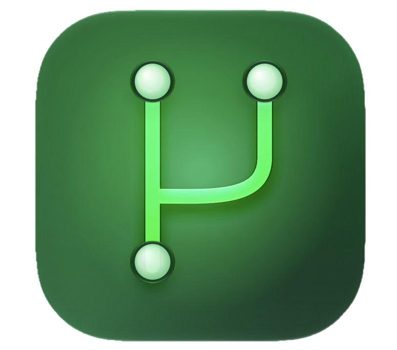

  
  <h1 style="display: inline-block; vertical-align: middle;">GitHubBrowser-MVC</h1>

# MVC (Model-View-Controller)

The classic Apple flavored MVC pattern, sometimes called Cocoa MVC. Built with UIKit.
 
## MVC explained
- MVC splits the app in three roles: `Model`, `View`, and `Controller`.
- The `Model` holds the app's data and the logic for fetching, decoding, and validating it. It knows nothing about the UI.
- The `View` displays whatever data it is given. It has no knowledge of the network or business logic.
- The `Controller` sits between the two. It asks the model for data and updates the `View` when that data changes.
- On iOS, the `UIViewController` plays the role of the Controller and also manages part of the view hierarchy, which is different from the original desktop MVC pattern.
- Communication flows one direction at a time: the `Controller` talks to the `Model`, the Controller updates the `View`, and the `View` reports user actions back to the Controller through target-action or delation.
- The `Model` and `View` NEVER directly talk to each other.
- Apple's frameworks (UIKit, Storyboards, `IBOutlet`, `IBAction`) are built around this pattern, which is why it is the default starting point for most iOS apps.

## What this project does

A small GitHub repository browser:
 
- A list screen that fetches and displays a user's public repositories
- A detail screen showing repository stats (stars, forks, description, language)
- Pull to refresh and basic error handling with a retry option
- Unit tests around the model layer
