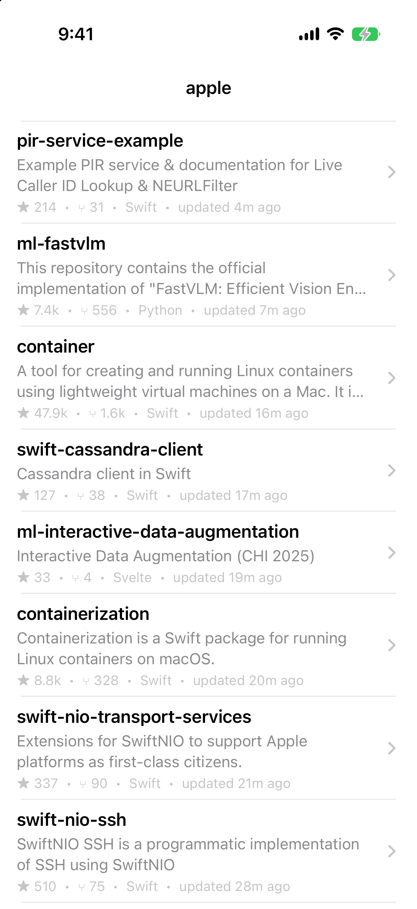
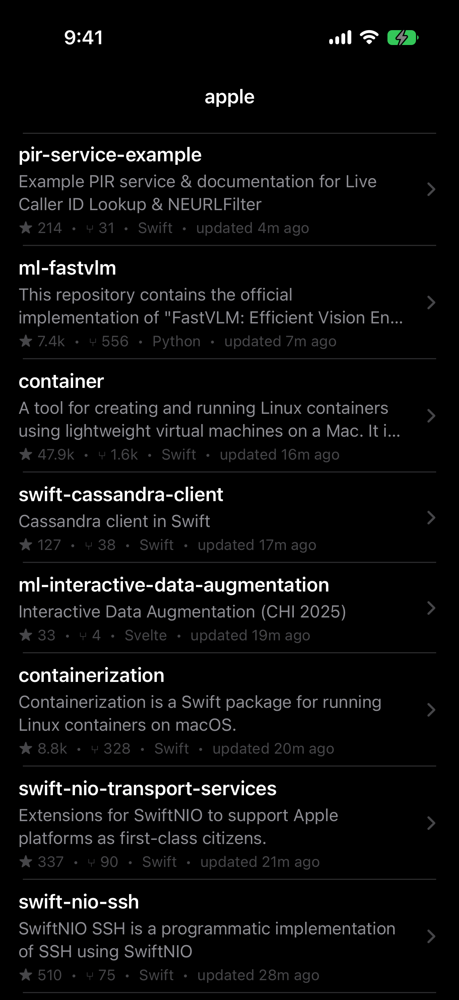
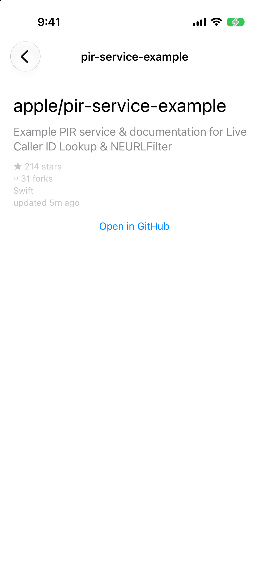
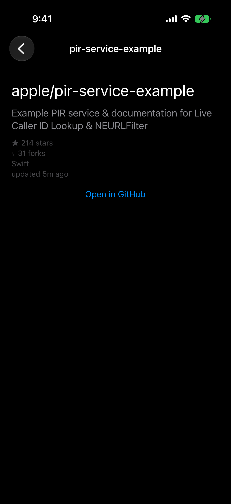
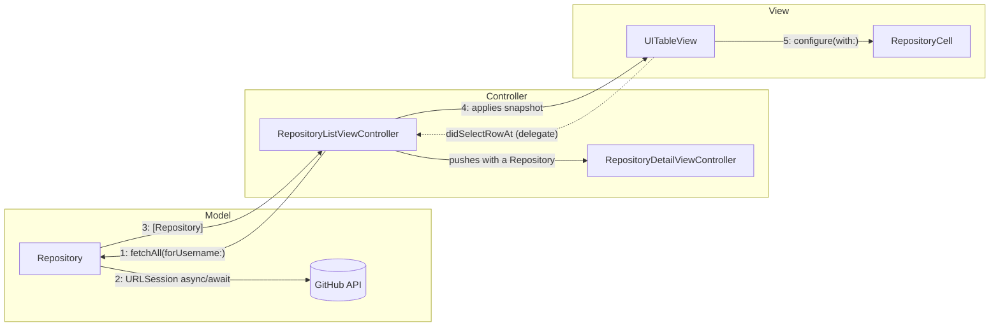

<div align="center">
  
  <h1 style="display: inline-block; vertical-align: middle;">GitHubBrowser-MVC</h1>
</div>

# MVC (Model-View-Controller)

The classic Apple flavored MVC pattern, sometimes called Cocoa MVC. Built with UIKit.
 
## MVC explained
- MVC splits the app in three roles: `Model`, `View`, and `Controller`.
- The `Model` holds the app's data and the logic for fetching, decoding, and validating it. It knows nothing about the UI.
- The `View` displays whatever data it is given. It has no knowledge of the network or business logic.
- The `Controller` sits between the two. It asks the model for data and updates the `View` when that data changes.
- On iOS, the `UIViewController` plays the role of the Controller and also manages part of the view hierarchy, which is different from the original desktop MVC pattern.
- Communication flows one direction at a time: the `Controller` talks to the `Model`, the Controller updates the `View`, and the `View` reports user actions back to the Controller through target-action or delation.
- The `Model` and `View` NEVER directly talk to each other.
- Apple's frameworks (UIKit, Storyboards, `IBOutlet`, `IBAction`) are built around this pattern, which is why it is the default starting point for most iOS apps.

## What this project does

A small GitHub repository browser:
 
- A list screen that fetches and displays a user's public repositories
- A detail screen showing repository stats (stars, forks, description, language)
- Pull to refresh and basic error handling with a retry option
- Unit tests across the model, formatting, view, and controller layers, plus UI tests that run against stubbed network data

## Screenshots

| | Light | Dark |
|---|---|---|
| **Repository list** |  |  |
| **Repository detail** |  |  |

## Built with

| Tool / Framework | Role |
|---|---|
| Swift 6 | Language, with strict concurrency and main-actor default isolation |
| UIKit | UI framework: view controllers, diffable data source, Auto Layout |
| Foundation | `URLSession` async/await networking, `JSONDecoder`, `RelativeDateTimeFormatter` |
| Swift Testing | Unit tests (`@Test`, `#expect`, parameterized cases) |
| XCTest + XCUIAutomation | UI tests that drive the app in the simulator |
| iOS 27 | Deployment target |
| Xcode 27 | IDE and build system |

No third party dependencies.

## Project structure
 
```
mvc/
  GitHubBrowser-MVC/                       the app target
    AppDelegate.swift                      app entry point, vends the scene configuration
    SceneDelegate.swift                    builds the window and the root navigation stack
    AccessibilityIdentifiers.swift         identifier strings shared by the views and the tests
    Models/
      Repository.swift                     the data and the logic to fetch it
    Views/
      RepositoryCell.swift                 the table view cell
      RepositoryFormatting.swift           string formatting used by the views
    Controllers/
      RepositoryListViewController.swift
      RepositoryDetailViewController.swift
    TestSupport/
      UITestNetworkStub.swift              DEBUG-only fixture data served during UI test runs
  GitHubBrowser-MVCTests/                  unit tests (Swift Testing)
    RepositoryModelTests.swift
    RepositoryErrorTests.swift
    RepositoryFormattingTests.swift
    RepositoryCellTests.swift
    RepositoryDetailViewControllerTests.swift
    RepositoryListViewControllerTests.swift
    StubURLProtocol.swift                  a network stub used only by the tests
    TestHelpers.swift                      fixtures and view-lookup helpers
  GitHubBrowser-MVCUITests/                UI tests (XCTest + XCUIAutomation)
    GitHubBrowser_MVCUITests.swift
  Screenshots/
  README.md
```

## Architecture at a glance



- Solid arrows are the Controller driving the Model and the View
- The dotted arrow is the View reporting a user action back through delegation
- The Model and the View never touch each other

## How MVC is structured here
 
**Model**
`Repository` is a plain struct that also knows how to fetch and decode itself from the GitHub API. This is the traditional Cocoa approach: the model layer owns its own data access. It has no import of UIKit anywhere.
 
**View**
`RepositoryCell` and the formatting helpers. Views only display data they are handed through a `configure(with:)` method. They never reach into the model layer or the network on their own.
 
**Controller**
`RepositoryListViewController` and `RepositoryDetailViewController`. The list controller asks the model for data, updates the table view with a diffable data source, and handles loading and error states. The detail controller receives its model directly from the list controller when the user taps a row.
 
```
RepositoryListViewController
  -> calls Repository.fetchAll(forUsername:)
  -> receives [Repository]
  -> updates the table view
 
RepositoryDetailViewController
  -> receives a single Repository from the list controller
  -> populates its view with that data
```
 
## How delegates work
 
Delegation is how the View reports things back to the Controller without knowing anything about it. It shows up constantly in this project through UIKit's own delegate protocols, so it is worth calling out on its own.
 
- A delegate is just an object that another object hands work off to, through a protocol
- The View defines a protocol describing what it needs help with, for example `tableView(_:didSelectRowAt:)`
- The Controller conforms to that protocol and sets itself as the View's delegate
- The View calls methods on its delegate when something happens, but it never knows the delegate is a `UIViewController`, only that it conforms to the protocol
- This keeps the View reusable. `UITableView` has no idea what a `Repository` is, it just calls its delegate when a row is tapped
- Delegate properties are almost always marked `weak` to avoid a retain cycle, since the delegate (the Controller) usually already owns the object it is the delegate of (the View)
In this project, `RepositoryListViewController` conforms to `UITableViewDelegate` and sets itself as the table view's delegate in `setUpTableView()`. When a row is tapped, the table view calls `tableView(_:didSelectRowAt:)` on the controller, which is where the push to `RepositoryDetailViewController` happens:
 
```
tableView (View)
  -> user taps a row
  -> calls delegate?.tableView(_:didSelectRowAt:)
  -> RepositoryListViewController (Controller) handles the tap
  -> pushes RepositoryDetailViewController
```
 
This is the same mechanism used for `UITextFieldDelegate`, `UIScrollViewDelegate`, and most other UIKit callbacks. It is one of the main ways a Controller finds out what happened in its View without the View needing to know anything about the Controller.
 
 MVC gets a bad reputation because the controller ends up owning too much: networking, layout, navigation, formatting, and business logic all in one file. That is not a flaw in MVC itself, it is what happens when there is no discipline about what belongs in the controller.
 
This project avoids that as much as MVC allows by:
 
- Keeping data fetching on the model, not inline in the controller
- Keeping formatting logic in a separate type instead of written directly in the controller
- Keeping the controller's job limited to loading state, requesting data, and updating the view

Even with that discipline, the view controller is still both the "controller" and part of the view hierarchy on iOS. That dual role is the root cause of "Massive View Controller" and is difficult to avoid completely without moving to a pattern that separates those responsibilities into different types, such as MVVM or VIPER.
 
## When to use MVC
 
- Small screens with limited logic
- Prototypes or early stage apps where architecture overhead is not worth it yet
- Teams new to iOS who need the simplest mental model before adopting something more structured

## When to avoid it
 
- Screens with complex state or a lot of business logic
- Apps that need high unit test coverage on view behavior, since view controllers are hard to test in isolation
- Large teams where multiple people work in the same view controller file at once

## Testing notes
 
Every layer is covered, and no test ever touches the live network. Run everything with **⌘U**.

**Unit tests (Swift Testing)**

- **Model** — `Repository.fetchAll` is exercised through a stubbed `URLProtocol`: successful decoding, `null` fields, empty responses, server errors, malformed JSON, transport failures, and the exact URL and `Accept` header it sends
- **Formatting** — `compactCount` across its magnitude boundaries (including the `999,999 → "1000.0k"` rounding quirk, pinned on purpose) and `relativeUpdatedAt` made deterministic by injecting the reference date and locale
- **Error copy** — every `RepositoryError.message` string the error alert can display is pinned, so wording changes are deliberate
- **Views** — `RepositoryCell` and the detail controller are configured with fixture models and their labels asserted through accessibility identifiers, without widening any access control
- **List controller** — built with an injected stubbed `URLSession`, hosted in a `UIWindow`, and driven through its real `viewDidLoad` load: table population, the empty state, and the error alert are all asserted

MVC's classic testability tradeoff still applies: the view controllers needed a small injection seam (`init(username:session:)`) to become testable at all, which is exactly the friction patterns like MVVM remove.

**UI tests (XCUIAutomation)**

Five end-to-end flows: list rendering, navigation to detail and back, the missing-description fallback, the empty state, and the error alert. Each launch passes a `UITEST_STUB_SCENARIO` environment value that the app (in DEBUG builds only) uses to serve fixture JSON instead of calling GitHub, so the suite is fast, deterministic, and immune to rate limits.

## Tradeoffs summary
 
| | |
|---|---|
| Setup speed | Fast |
| Learning curve | Low |
| Testability | Good for the model, poor for view controller logic |
| Scalability | Poor past a handful of screens |
| Apple tooling fit | Natural fit for UIKit, no extra abstraction needed |
