<div align="center">
  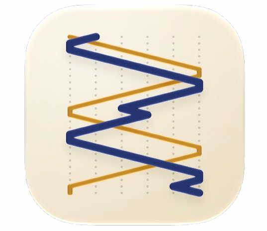
  <h1 style="display: inline-block; vertical-align: middle;">ChangeRinger-MVP</h1>
</div>

# MVP (Model-View-Presenter)

MVP with a strictly passive view. Built for iOS as a document based app with UIKit, `UIDocument`, and AVFoundation.

## MVP explained

- MVP splits the app into three roles: `Model`, `View`, and `Presenter`.
- The `Model` holds the app's data and the rules that operate on it. It knows nothing about the UI.
- The `View` is passive. It owns no state, makes no decisions, and does nothing on its own. It exposes a protocol of commands it can perform (`display(rows:)`, `showTruthFailure(at:)`, `setSaveIndicator(_:)`) and forwards raw user intent to the `Presenter`.
- The `Presenter` owns everything else for one screen: it holds the state, calls the `Model`, formats the results, and tells the `View` exactly what to render, one method call at a time.
- The `Presenter` talks to the `View` only through a protocol, never through a concrete view controller type. That protocol is the entire contract, and it is the reason a `Presenter` can be tested with no window, no view hierarchy, and no run loop.
- The difference from MVVM is direction and explicitness. A ViewModel publishes state and waits to be observed. A Presenter reaches out and commands: it decides that the truth banner should appear now, in red, saying this, and it says so.
- That explicitness is the pattern's whole personality. Nothing happens because a binding fired. Everything happens because a Presenter called a method, and every one of those calls is a line a test can assert on.
- A `View` in MVP contains no `if`. The moment a view controller decides something, the Presenter has been bypassed and the pattern has stopped paying out.

## Why MVP earns its keep in a document based app

In a screen that renders a struct and a couple of buttons, MVP looks like MVVM with extra typing. The protocol is boilerplate, the Presenter is a ViewModel that is bad at SwiftUI, and the honest answer is to use something else.

A document based app removes that argument. `UIDocument` is not a value you render. It is a live object with a lifecycle you do not control:

- Opening is asynchronous and can fail, and the file may be a placeholder that has not downloaded yet.
- Saving is not something you call, it is something the system decides to do, on its own schedule, by asking you for a snapshot at an arbitrary moment.
- The document changes state underneath you: `.editingDisabled`, `.savingError`, `.inConflict`, `.closed`, each arriving as a notification rather than a return value.
- A conflict means two real versions of the user's work exist at once, and something has to present that choice and then resolve it.
- The user can rename, move, or delete the file from the browser, from Files, or from another device, while your editor is on screen.

That is a stateful, asynchronous, failure-prone flow driven entirely by things that are not the user tapping. A view controller handed that job ends up as a pile of notification observers with layout code between them. This project puts all of it behind one `TouchEditorPresenter` and one `DocumentStoring` seam, and the view controller stays a set of outlets and forwarding methods.

## What this project does

A change ringing composition editor, for the English tower bell tradition of ringing permutations rather than tunes:

- A **document browser** for creating, renaming, and opening `.touch` compositions, backed by the system document browser.
- An **editor** showing the touch expanded row by row as a scrolling grid, with the blue line of a chosen bell traced through it.
- A **notation bar** for editing the underlying place notation directly, and a call strip for inserting bobs and singles at lead ends.
- A **truth check** that runs on every edit and marks the exact row where a composition repeats itself.
- **Playback** of the row sequence through AVAudioEngine, at a real ringing pace, so a composition can be heard rather than only read.
- A full ringing engine with no network layer at all, and no `URLSession` anywhere in the project.

## The domain

Change ringing is what English church bells actually do. A tower's bells are too heavy to play a melody: a ring of eight can weigh several tons, each bell takes a full second to swing, and a ringer can only nudge its timing slightly. So instead of tunes, ringers ring permutations. All the bells sound once per row, in order, and the order changes by a small, legal amount each row. It has been done this way since the 1600s, and *Tintinnalogia* set the rules down in 1668.

Bells are numbered by pitch, 1 being the highest (the treble) and the last being the lowest (the tenor). A **row** is one permutation, written `123456`. **Rounds** is the row in order, and it is where everything starts and ends. A **change** is the step from one row to the next.

**The constraint that generates everything else**

A bell cannot jump. Between one row and the next, a bell may move at most one position, because physically it has one swing to do it in. So every change is a set of adjacent pairs swapping, and any bell not swapping stays where it is and "makes a place". This single physical fact is why change ringing is a permutation puzzle rather than a musical one.

**Place notation**

The shorthand for a change: list the places that stay put, and everything else swaps in pairs. `X` means all bells swap. `16` on six bells means bells in positions 1 and 6 hold while 2-3 and 4-5 swap. A **method** is a repeating cycle of notation. Plain Bob Minor is `X16X16X16X12`, and that is the entire definition of the method.

**Stages**

| Name | Bells | Rows in a full extent |
|---|---|---|
| Doubles | 5 | 120 |
| Minor | 6 | 720 |
| Triples | 7 | 5,040 |
| Major | 8 | 40,320 |

An extent is every possible row rung exactly once. A peal is 5,040 rows or more, takes about three hours, and nobody sits down.

**The rules that make it interesting**

These four are why a ringing engine is worth modeling, and worth keeping entirely free of the UI:

- **A touch must be true.** No row may repeat. Not once, anywhere, across thousands of rows. Truth is the composition's whole quality bar, and checking it is set membership over the entire expansion rather than a check you can do locally at the point of an edit.
- **A touch must come round.** It starts at rounds, and it has to arrive back at rounds and stop there. A composition that never returns is not short, it is invalid.
- **Calls only happen at lead ends.** A bob or a single substitutes different notation for one change, but only at the one position in the method's cycle where a call is legal. Inserting a call is therefore not a free edit, and the engine has to say no.
- **A call changes everything after it.** Rows are generated by folding notation over the previous row, so a bob inserted at row 12 rewrites every row from 12 to the end. There is no partial recompute, which is exactly what makes the boundary between the engine and the screen worth drawing hard.

That set of rules is a compact, closed, deterministic state machine with no randomness and no hidden information, which is exactly what makes `RingingEngine` worth testing hard and worth keeping out of the view controller.

## Screenshots

| Screen | Light | Dark |
|---|---|---|
| **Document browser** | 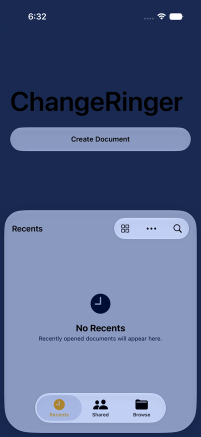 | 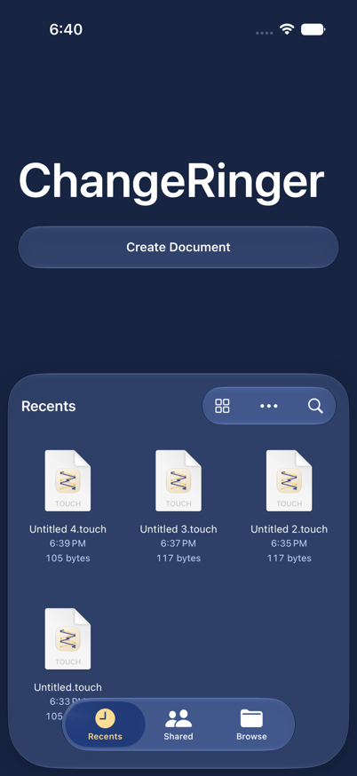 |
| **Touch editor** | 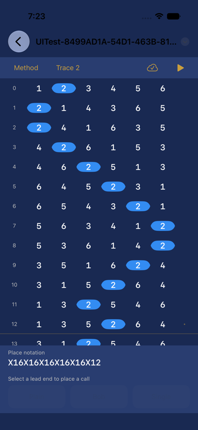 | 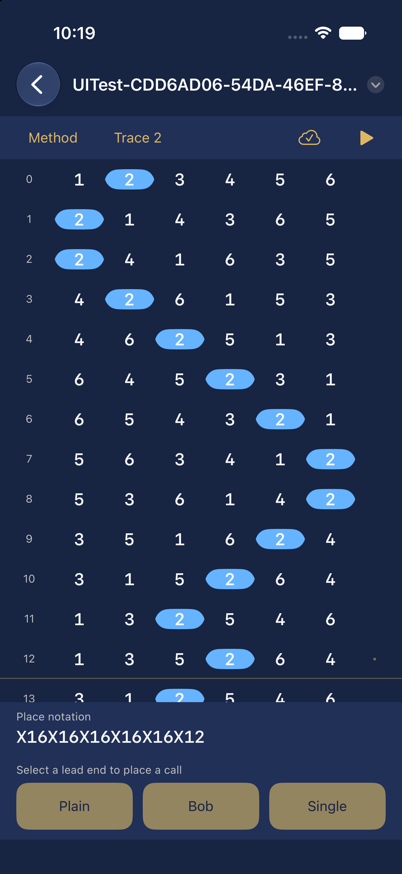 |
| **Blue line** | 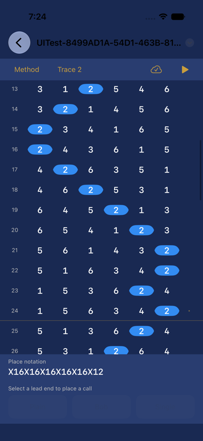 | 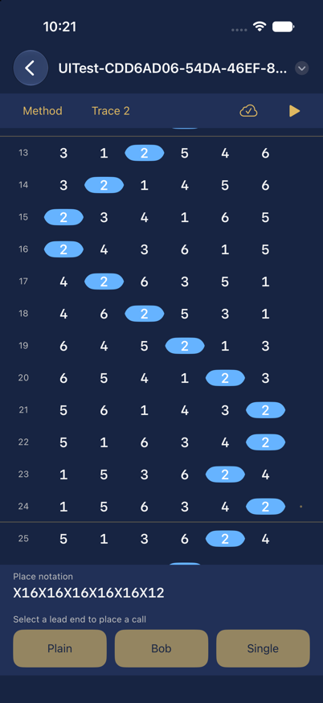 |
| **Truth failure** | 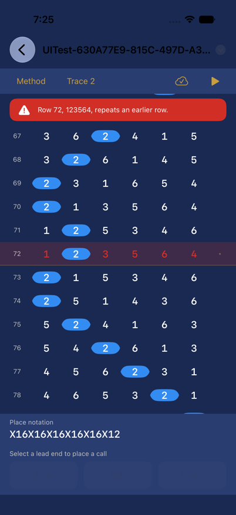 | 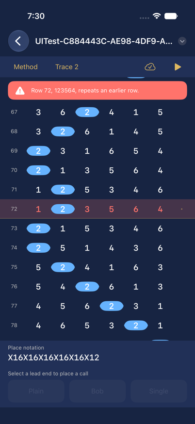 |
| **Call strip** | 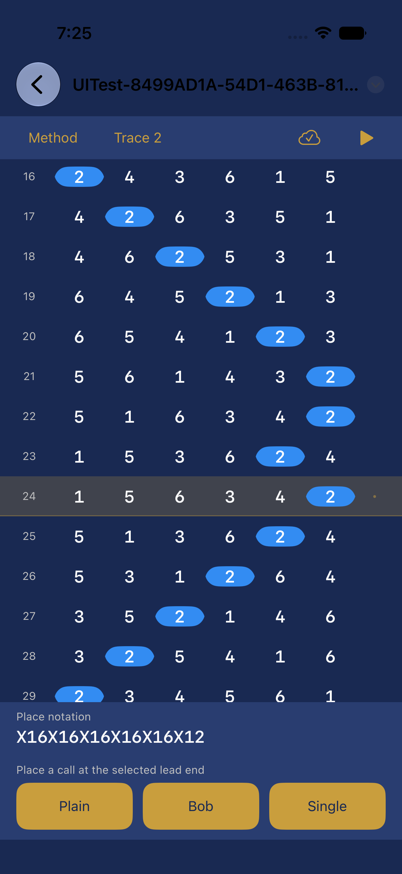 | 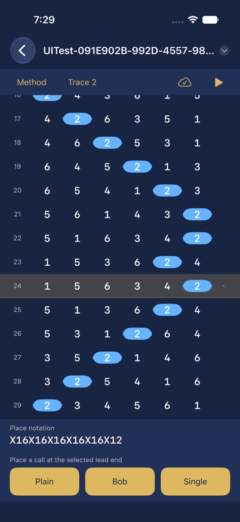 |
| **Conflict resolution** | 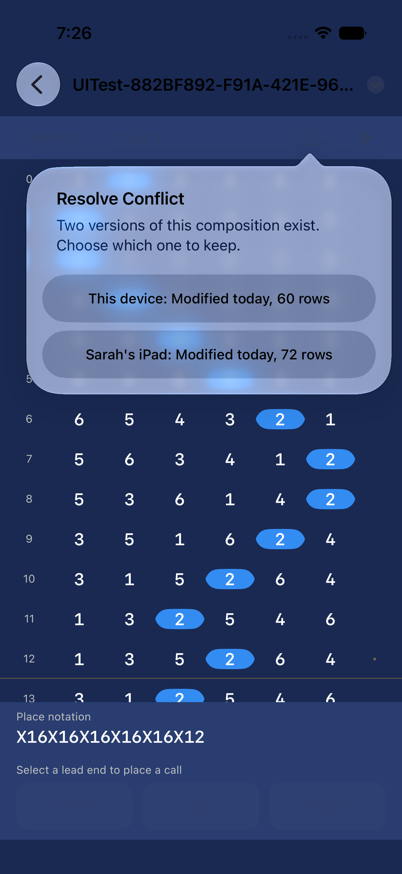 | 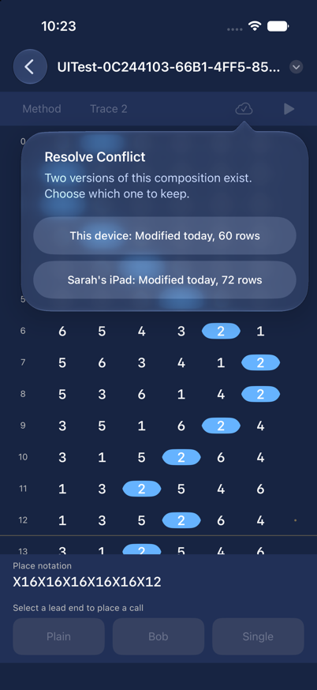 |

## Built with

| Tool / Framework | Role |
|---|---|
| Swift 6 | Language, with strict concurrency and main-actor default isolation |
| UIKit | UI framework, view controllers and compositional layout for the row grid |
| UIDocument | The `.touch` document: asynchronous open, autosave, state changes, conflicts |
| UIDocumentViewController | The editor's base class, and the app's document lifecycle entry point |
| UIDocumentBrowserViewController | The file browser, provided by the system |
| UniformTypeIdentifiers | The exported `.touch` type declaration |
| AVFoundation | `AVAudioEngine` and sampled bell strikes for playback |
| Swift Testing | Unit tests (`@Test`, `#expect`, parameterized cases) |
| XCTest + XCUIAutomation | UI tests that drive the app in the simulator |
| iOS 27 | Deployment target |
| Xcode 27 | IDE and build system |

No Combine and no Observation, deliberately. A Presenter that publishes state is a ViewModel wearing a protocol. No third party dependencies.

## Project structure

```
mvp/
  ChangeRinger-MVP/                        the app target
    ChangeRingerAppDelegate.swift          app entry point, declares the document scene
    AccessibilityIdentifiers.swift         identifier strings shared by the views and the tests
    Models/
      Row.swift                            one permutation of the bells, and its validity
      Stage.swift                          doubles, minor, triples, major
      PlaceNotation.swift                  parsing and applying notation to a row
      Method.swift                         name, stage, notation cycle, lead head
      Call.swift                           plain, bob, single, and where each is legal
      Touch.swift                          the composition: method, calls, target length
      RingingEngine.swift                  folds notation over rows to expand a touch
      TruthChecker.swift                   repeated rows, comes round, legal changes
      TouchDocument.swift                  the UIDocument subclass and its file format
    Presenters/
      TouchEditorPresenter.swift           the only type that knows both the engine and the screen
      MethodPickerPresenter.swift
      PlaybackPresenter.swift
      DocumentStoring.swift                a protocol over UIDocument's open, save, and state
    Views/
      TouchEditorViewController.swift      a UIDocumentViewController subclass
      TouchEditorView.swift                the protocol the presenter commands
      MethodPickerViewController.swift
      MethodPickerView.swift               the protocol the picker presenter commands
      Components/
        RowGridView.swift                  the scrolling rows and the blue line overlay
        NotationBarView.swift
        CallStripView.swift
        TruthBannerView.swift
  ChangeRinger-MVPTests/                   unit tests (Swift Testing)
    RingingEngineTests.swift
    PlaceNotationTests.swift
    TruthCheckerTests.swift
    TouchEditorPresenterTests.swift
    MethodPickerPresenterTests.swift
    SpyTouchEditorView.swift               records the commands the presenter sends
    StubDocumentStore.swift                a document lifecycle with no file behind it
    TestHelpers.swift                      method fixtures and row notation helpers
  ChangeRinger-MVPUITests/                 UI tests (XCTest + XCUIAutomation)
    ChangeRinger_MVPUITests.swift
  Screenshots/
  README.md
```

## Architecture at a glance

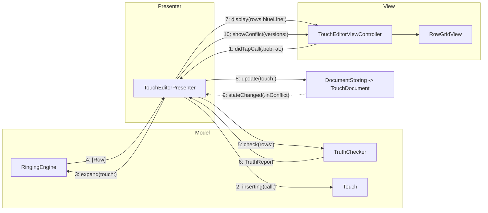

- Solid arrows are commands: the View forwards intent, the Presenter drives the Model, the Presenter tells the View what to draw
- The dotted arrow is the document lifecycle reporting upward, on its own schedule, without anyone having asked
- No View ever reads the Model, and no Model type ever imports UIKit

## How MVP is structured here

**Model**
`RingingEngine` is a pure, static type: it takes a `Touch` and returns the expanded `[Row]`, or a rejection reason if a call sits somewhere no call is legal. `TruthChecker` takes rows and returns a `TruthReport`. No mutation, no async, no `import UIKit`, no knowledge that a screen exists. Every rule of the domain lives here, including the three that make change ringing worth modeling: a bell may move at most one place per change, no row may repeat, and a touch must come round.

`TouchDocument` is the one model type that touches the system. It owns `contents(forType:)` and `load(fromContents:ofType:)` and nothing else. The parsing lives in `PlaceNotation`, so the document is a file format and not a place where logic goes to hide.

**View**
`TouchEditorViewController` conforms to `TouchEditorView` and implements it literally. `display(rows:blueLine:)` reloads the grid. `showTruthFailure(at:message:)` sets the banner. `setSaveIndicator(_:)` sets an image. Every method is one instruction, and there is no branch in the file. User actions go straight out: a tap on the call strip becomes `presenter.didTapCall(.bob, at: index)` and the view controller stops caring.

**Presenter**
`TouchEditorPresenter` is the only place that knows both the domain and the screen. It holds the current `Touch`, asks the engine to expand it, asks the checker whether it is true, formats the rows into display strings, decides that the blue line follows bell 2, and then issues the commands. It has a reference to a `TouchEditorView` protocol and a `DocumentStoring` protocol, and it has never heard of `UIViewController`.

```
TouchEditorViewController
  -> user taps Bob
  -> presenter.didTapCall(.bob, at: 12)

TouchEditorPresenter
  -> inserts the call into the Touch
  -> asks RingingEngine to expand from row 12 onward
  -> asks TruthChecker whether the result is still true
  -> calls view.display(rows:blueLine:)
  -> calls view.showTruthFailure(at:message:) if it is not
  -> calls store.update(touch:), which marks the document dirty

TouchDocument
  -> autosaves whenever it feels like it
  -> reports .savingError or .inConflict back through DocumentStoring
  -> the presenter decides what the user sees about that
```

## How the document lifecycle works

This is the part that has no equivalent in the MVC or MVVM projects, so it is worth walking through on its own.

- `DocumentStoring` is a protocol with four members: `open() async throws`, `update(touch:)`, `close() async`, and `var stateChanged: ((DocumentState) -> Void)?`. That is the entire surface the Presenter is allowed to see.
- The real implementation wraps a `TouchDocument`, forwards `updateChangeCount(.done)` on every edit, and translates `UIDocument.stateChangedNotification` into `DocumentState` values. The test implementation returns whatever the test wants and records what it was asked to do.
- That protocol is the seam. It is why `TouchEditorPresenterTests` can assert what the user sees when a save fails, without a file, a file coordinator, or a simulator, in milliseconds.
- Opening is async and can fail, so the Presenter owns the loading state. The view controller does not have a `Task` in it, and does not know that opening a file is a thing that takes time.
- Autosave means the app never calls save. The Presenter's only job is to mark the document dirty accurately and to render the result honestly, which is `setSaveIndicator(.saving)` and `setSaveIndicator(.saved)` and nothing more.
- Conflicts are the interesting case. `.inConflict` arrives unprompted, the Presenter asks the store for the versions, formats them into a summary of what differs, and calls `view.showConflict(versions:)`. When the user picks one, the choice comes back through `presenter.didResolveConflict(with:)`, and the Presenter tells the store to keep it and mark the others resolved. The view controller has presented a list and reported a tap. That is all it did.
- The user can also delete the file from Files while the editor is open. The state change arrives, the Presenter calls `view.dismissWithMessage(_:)`, and the pattern held.

```
TouchDocument (system)
  -> a second device saves a different version
  -> DocumentStoring reports .inConflict
  -> TouchEditorPresenter formats both versions and calls view.showConflict(versions:)
  -> TouchEditorViewController presented a list
  -> the view controller never learned what a conflict is
```

MVP's cost is real and worth naming: the view protocol is written by hand, it grows a method every time the screen learns a new trick, and a screen with twenty commands has a twenty method protocol with no way around it. What you buy is that the entire behavior of a screen, including everything the system does to it without being asked, is a plain object with two injected protocols, and the test for "what does the user see when saving fails" is three lines and no filesystem.

## When to use MVP

- Screens driven by something other than the user: document lifecycles, background state, hardware, anything that arrives as a notification.
- UIKit codebases, where a passive view protocol fits the view controller's shape better than a bindings layer bolted on.
- Teams that want the exact sequence of UI updates asserted, not just the final state.
- Migrations, where a Presenter can be extracted from a large view controller one method at a time without rewriting the view.

## When to avoid it

- SwiftUI, where the view is already a function of state and a commanding Presenter fights the framework the whole way
- Simple screens, where the protocol is longer than the logic behind it
- Anywhere the team will let view controllers make one small decision "just this once", since a Presenter that only owns most of the screen owns none of it

## Testing notes

Every layer is covered, and nothing in the suite requires a device, a file, or a network. Run everything with **⌘U**.

**Unit tests (Swift Testing)**

- **Ringing engine**: the whole point of choosing this domain. Parameterized cases across four methods and four stages, the sixty-row plain course of Plain Bob Minor expanding to distinct true rows that come round, a bobbed touch that stays true and comes round, calls being legal only at lead ends, and every change moving each bell at most one place. Rows are written in their natural notation in `TestHelpers`, so a test reads like a line of ringing.
- **Truth checker**: a true touch, a touch that repeats a row (its exact false-row index asserted), a touch that never comes round, and a touch that comes round early, plus truth holding across a full extent of 720 distinct rows. The reported failure index is asserted, not just the boolean.
- **Place notation**: parsing `X16X16X16X16X16X12`, rejecting notation that names a place twice, and the round trip back to a string.
- **TouchEditorPresenter**: built with `SpyTouchEditorView` and `StubDocumentStore`, then driven through the same methods the view controller calls. Asserts the exact commands sent, in order: that inserting a bob triggers one `display(rows:)` and no truth banner when the result is true, that an illegal call (one placed anywhere but a lead end) triggers an error message and leaves the rows untouched, and that opening a document that throws produces an error state rather than an empty grid.
- **Document lifecycle**: `StubDocumentStore` fires `.savingError` and `.inConflict` on command, and the tests assert the Presenter's response to each. Deleting the document underneath the editor is a test, not a crash report.

That last suite is the payoff. In the MVC project, a save failure is a notification observer inside a view controller and is only reachable by breaking a real file on a real simulator. Here it is a closure call on a stub, and it runs in milliseconds.

**UI tests (XCUIAutomation)**

Four end-to-end flows: opening a composition in the editor, changing the method and seeing the rows regenerate, inserting a bob and hitting a truth failure, and starting playback. Each launch passes a `UITEST_SCENARIO` environment value that the app (in DEBUG builds only) uses to open the editor directly on a seeded fixture `Touch`, bypassing the system document browser, whose asynchronous, cross-process presentation is too non-deterministic to drive reliably. The browser flow itself is exercised by hand and in the screenshots above.

## Tradeoffs summary

| | |
|---|---|
| Setup speed | Moderate, the view protocol is real work before the first pixel |
| Learning curve | Low, the rule is easy to state and the compiler enforces most of it |
| Testability | Excellent, including the parts of the screen the user did not cause |
| Scalability | Good, though the view protocol grows with the screen and never shrinks |
| Apple tooling fit | Natural in UIKit, actively wrong in SwiftUI |
