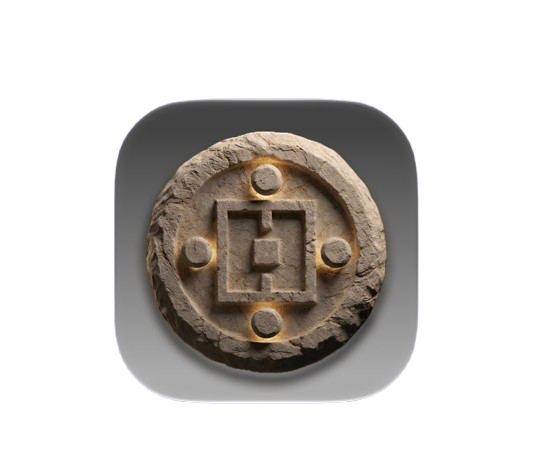
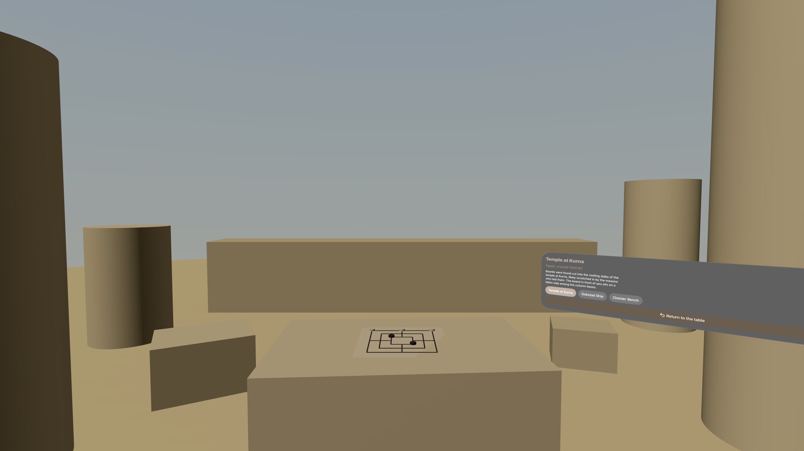
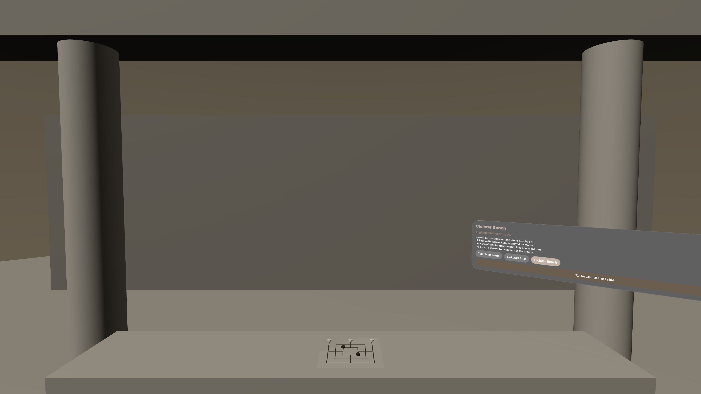
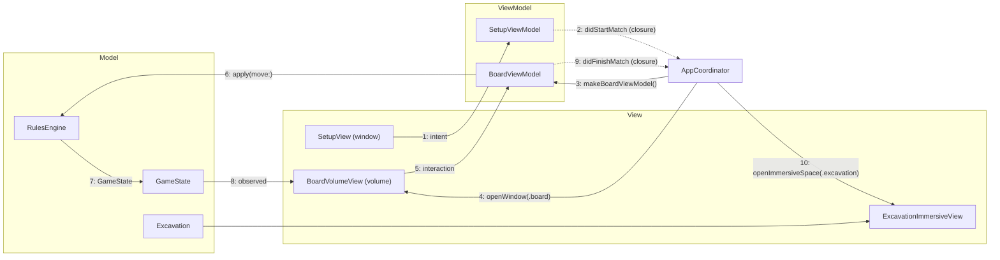

<div align="center">
  
  <h1 style="display: inline-block; vertical-align: middle;">StoneMill-MVVMC</h1>
</div>

# MVVM-C (Model-View-ViewModel-Coordinator)

MVVM with a Coordinator layered on top to own navigation. Built for visionOS with SwiftUI, TabletopKit, and RealityKit.

## MVVM-C explained

- MVVM-C splits the app into four roles: `Model`, `View`, `ViewModel`, and `Coordinator`.
- The `Model` holds the app's data and the rules that operate on it. It knows nothing about the UI and nothing about navigation.
- The `View` is a pure function of state. It renders what the `ViewModel` publishes and forwards user intent back to it.
- The `ViewModel` owns presentation state for exactly one screen. It talks to the `Model`, exposes display-ready values, and knows nothing about what screen comes next.
- The `Coordinator` owns navigation. It decides which screens exist, in what order, and how they are presented. It creates ViewModels and hands them their dependencies.
- MVVM alone leaves a hole: something has to decide where to go next, and by default that ends up inside the `View` (a `NavigationLink` hardcoding its destination) or inside the `ViewModel` (which then has to know about UIKit, SwiftUI scenes, or other screens). The `Coordinator` is the type that hole was cut for.
- A `ViewModel` reports *what happened* ("the match ended"), not *what to do about it* ("push the results screen"). The `Coordinator` decides the second part.
- This means a screen can be lifted into a different flow, or a different app, without touching it. Only the `Coordinator` changes.

## Why a Coordinator earns its keep on visionOS

On iOS, MVVM-C is often a hard sell: `UINavigationController` already exists, and a Coordinator can look like ceremony wrapped around a `pushViewController` call.

visionOS removes that argument. There is no navigation stack across scenes. Moving the user between a window, a volume, and an immersive space means:

- Calling `openWindow`, `openImmersiveSpace`, and `dismissImmersiveSpace` from the SwiftUI environment
- `await`ing the result of opening an immersive space, which can fail or be denied
- Enforcing that only one immersive space can be open at a time, system-wide
- Reacting to the user dismissing a scene from outside your app, via the Digital Crown or the window's close control

That is a stateful, asynchronous, failure-prone flow with rules that span multiple scenes. No single view has the vantage point to run it. This project puts all of it in one `AppCoordinator`, and every scene stays a dumb renderer of the state it is handed.

## What this project does

A spatial implementation of Nine Men's Morris, a board game carved into temples, ship decks, and cloister benches for roughly two thousand years:

- A setup **window** for choosing opponents, reading the rules primer, and browsing finished matches
- A **volume** holding the board itself, built on TabletopKit, with real placement, sliding, mill capture, and the endgame "flying" phase
- An **immersive space** placing you inside three locations where the board has actually been found carved, with the real board rendered in situ
- A full rules engine with no network layer at all, and no `URLSession` anywhere in the project

## The game
 
Nine Men's Morris, also called Mill, Merels, or Mühle. It is one of the oldest board games still played, and one of the best evidenced: the board turns up carved into the roofing slabs of the temple at Kurna in Egypt, cut into the deck planks of the Gokstad Viking ship, and worn into cloister benches across medieval Europe, where bored monks apparently played it for centuries. It was popular enough in Elizabethan England that Shakespeare could reference the nine men's morris in *A Midsummer Night's Dream* and expect the audience to know it. The rules below are the standard modern form.
 
The board is 24 points arranged as three concentric squares, connected by four lines running through the midpoints of their sides. Each player has nine pieces. Pieces sit on points, not in spaces.
 
**The goal**
 
Reduce your opponent to two pieces, or leave them with no legal move. Either one wins.
 
**A mill**
 
Three of your own pieces in an unbroken straight line along one of the board's 16 lines. Forming a mill lets you immediately remove one enemy piece from the board, permanently.
 
**The three phases**
 
| Phase | Begins when | What you may do |
|---|---|---|
| Placing | The game starts | Take turns placing one piece on any empty point until all 18 are down |
| Moving | Both players have placed all nine | Slide one piece per turn to an adjacent empty point along a line |
| Flying | You are reduced to exactly three pieces | Move one piece per turn to *any* empty point on the board |
 
Flying is per player, not per game. One side can be flying while the other is still sliding, and that asymmetry is usually what decides the endgame.
 
**The rules that make it interesting**
 
These four are the ones that carry all the strategy, and they are the reason this game is worth modeling rather than, say, tic-tac-toe:
 
- **A mill you re-form still counts.** Slide a piece out of a mill and back in on your next turn, and the mill forms again and captures again. A pair of mills sharing a piece is a "double mill" or windmill, and it removes one enemy piece every single turn. Building one is usually the whole game plan.
- **You may not capture a piece that is in a mill,** unless every one of your opponent's pieces is in a mill. This protects a completed mill from being dismantled and makes the exception genuinely rare and genuinely decisive.
- **Being blocked is a loss, not a stalemate.** If it is your turn and you have no legal move, you lose. There is no draw by that route.
- **Mills only capture on the turn they form.** A standing mill does nothing. It has to be broken and rebuilt to pay out again, which is what makes the moving phase a constant negotiation between holding a mill and using it.
That set of rules is a compact, closed, deterministic state machine with no randomness and no hidden information, which is exactly what makes `RulesEngine` worth testing hard and worth keeping entirely free of the UI.

## Screenshots

| | Window | Volume |
|---|---|---|
| **Setup and history** |  |  |

| | Placing | Flying |
|---|---|---|
| **Tabletop phases** |  |  |

| | Kurna temple roof | Cloister bench |
|---|---|---|
| **Immersive space** |  |  |

## Built with

| Tool / Framework | Role |
|---|---|
| Swift 6 | Language, with strict concurrency and main-actor default isolation |
| SwiftUI | UI framework: `WindowGroup`, `ImmersiveSpace`, and the volumetric window style |
| TabletopKit | Seats, equipment, snapping, and interaction on the board volume |
| RealityKit | Piece and board entities, materials, and the immersive scene content |
| Observation | `@Observable` ViewModels, no Combine |
| SwiftData | Local match history persistence |
| Swift Testing | Unit tests (`@Test`, `#expect`, parameterized cases) |
| XCTest + XCUIAutomation | UI tests that drive the app in the simulator |
| visionOS 27 | Deployment target |
| Xcode 27 | IDE and build system |

No third party dependencies.

## Project structure

```
mvvm-c/
  StoneMill-MVVMC/                         the app target
    StoneMillApp.swift                     app entry point, owns the AppCoordinator, declares the scenes
    AccessibilityIdentifiers.swift         identifier strings shared by the views and the tests
    Models/
      Board.swift                          the 24 points, the 16 lines, adjacency
      GameState.swift                      whose turn, phase, pieces in hand, pieces on board
      GamePhase.swift                      placing, moving, flying, gameOver
      RulesEngine.swift                    legal moves, mill detection, capture rules, win conditions
      Excavation.swift                     the three historical sites and their placement data
      MatchRecord.swift                    the SwiftData model for finished matches
    ViewModels/
      SetupViewModel.swift
      BoardViewModel.swift                 the only type that translates rules into tabletop actions
      ExcavationViewModel.swift
      MatchHistoryViewModel.swift
    Coordinator/
      AppCoordinator.swift                 owns scene transitions and vends ViewModels
      Route.swift                          the enumerated destinations this app can be in
      SceneOpening.swift                   a protocol over openWindow / openImmersiveSpace
    Views/
      SetupView.swift
      MatchHistoryView.swift
      BoardVolumeView.swift                the TabletopKit surface
      ExcavationImmersiveView.swift
      Tabletop/
        StoneMillTabletopGame.swift        TabletopGame conformance
        BoardSetup.swift                   equipment, seats, and the board's spatial layout
        PieceEquipment.swift
        InteractionHandler.swift           forwards TabletopKit interactions to the BoardViewModel
  StoneMill-MVVMCTests/                    unit tests (Swift Testing)
    RulesEngineTests.swift
    BoardGeometryTests.swift
    BoardViewModelTests.swift
    SetupViewModelTests.swift
    AppCoordinatorTests.swift
    SpySceneOpener.swift                   records scene transitions instead of performing them
    TestHelpers.swift                      board fixtures and position notation helpers
  StoneMill-MVVMCUITests/                  UI tests (XCTest + XCUIAutomation)
    StoneMill_MVVMCUITests.swift
  Screenshots/
  README.md
```

## Architecture at a glance



- Solid arrows are ownership and data flow: the Coordinator builds ViewModels, ViewModels drive the Model, Views observe state
- Dotted arrows are ViewModels reporting events upward without knowing who is listening
- No View ever opens a scene, and no ViewModel ever names another screen

## How MVVM-C is structured here

**Model**
`RulesEngine` is a pure, static type: it takes a `GameState` and a proposed move and returns either a new `GameState` or a rejection reason. No mutation, no async, no `import SwiftUI`, no `import TabletopKit`. Every rule of the game lives here, including the three that make Nine Men's Morris interesting: a mill you break and immediately re-form still counts, you may not capture a piece that is part of a mill unless every enemy piece is, and a player reduced to three pieces may "fly" to any empty point.

**View**
`BoardVolumeView`, `SetupView`, and `ExcavationImmersiveView`. Each observes exactly one `@Observable` ViewModel and forwards intent to it. The tabletop views translate TabletopKit interactions into method calls and nothing else. There is no rule logic inside the interaction handler.

**ViewModel**
`BoardViewModel` is the only place that knows both the rules and the tabletop. It holds the current `GameState`, converts board points into TabletopKit equipment positions, decides what is highlighted, and exposes plain values (`statusText`, `selectablePoints`, `capturablePieces`). It has no reference to any other screen and no way to open one.

**Coordinator**
`AppCoordinator` owns a `Route` and the `SceneOpening` dependency. It creates every ViewModel, injects the model layer, subscribes to their event closures, and performs every scene transition.

```
SetupViewModel
  -> user taps Start
  -> validates the configuration
  -> calls didStartMatch(configuration)

AppCoordinator
  -> receives didStartMatch
  -> builds a GameState and a BoardViewModel
  -> opens the board volume

BoardViewModel
  -> plays out the match against RulesEngine
  -> calls didFinishMatch(record)

AppCoordinator
  -> persists the record
  -> dismisses the volume and offers the excavation space
```

## How the Coordinator works across scenes

This is the part that has no equivalent in the MVC project, so it is worth walking through on its own.

- A `Route` enum lists everything this app can be showing: `.setup`, `.board(GameState.ID)`, `.excavation(Excavation.ID)`. It is data, not behavior.
- The `AppCoordinator` is `@Observable` and is created once in `StoneMillApp` and injected into the environment. It is the single source of truth for what is open.
- Every scene transition goes through one method on the Coordinator. Views never import `openWindow` or `openImmersiveSpace` themselves. That import is the smell this pattern exists to remove.
- Because opening an immersive space is `async` and returns a result, the Coordinator is the type that handles `.userCancelled` and `.error`. A View forced to do this ends up with a `Task` and a `switch` in its body.
- The system enforces one immersive space at a time. The Coordinator enforces the corollary: dismiss the current one before opening the next, and never leave the app in a state where the user has closed a scene the app still believes is open.
- ViewModels communicate upward through closures assigned by the Coordinator (`var didFinishMatch: ((MatchRecord) -> Void)?`), which is delegation without the protocol. The ViewModel calls it and never learns who was on the other end.
- The Coordinator's dependency on the SwiftUI environment actions is wrapped in a `SceneOpening` protocol. The real implementation forwards to `openWindow` and `openImmersiveSpace`; the test implementation records the calls. This is the seam that makes navigation itself unit testable, which is the thing MVVM alone cannot offer.

```
BoardVolumeView (View)
  -> user finishes the match
  -> BoardViewModel.didFinishMatch(record)
  -> AppCoordinator persists, dismisses the volume, opens the excavation space
  -> BoardVolumeView never knew the excavation space existed
```

MVVM-C's cost is real and worth naming: this project has four types where the MVC project has two, and the indirection means tracing a single tap through the app takes more jumps. What you buy is that navigation is a testable object rather than a side effect scattered across view bodies, which on a platform with three scene types and an async, cancellable, one-at-a-time immersive space is a trade that pays for itself immediately.

## When to use MVVM-C

- Apps where navigation is itself complex: conditional flows, deep links, onboarding that branches, or visionOS scene transitions
- Screens that need to be reused in more than one flow, or A/B tested in different orders
- Codebases that want navigation logic under unit test rather than only under UI test
- Teams large enough that "which screen comes next" is a decision worth centralizing

## When to avoid it

- Small apps with a linear stack, where a `NavigationStack` and a `path` binding already say everything
- Prototypes, where the extra type is friction with no return yet
- Teams that will not hold the line on the rule that ViewModels never name other screens, since a Coordinator that gets bypassed once is worse than no Coordinator at all

## Testing notes

Every layer is covered, and nothing in the suite requires a device or a network. Run everything with **⌘U**.

**Unit tests (Swift Testing)**

- **Rules engine**: the whole point of choosing this game. Parameterized cases across all 16 mills, the re-formed mill rule, the "cannot capture from a mill unless all pieces are in mills" exception, the transition into flying at three pieces, and both loss conditions (reduced to two pieces, and having no legal move). Board positions are written in a compact notation in `TestHelpers` so a test reads like a diagram.
- **Board geometry**: adjacency and the point-to-equipment position mapping, pinned so a layout tweak cannot silently break the rules
- **BoardViewModel**: built with a fixture `GameState`, driven through the interaction methods the tabletop calls, asserting published state and that `didFinishMatch` fires exactly once with the right winner
- **Coordinator**: built with `SpySceneOpener`, then driven through the same event closures the real ViewModels call. Asserts that starting a match opens the volume, that finishing dismisses it before opening the immersive space, and that a denied immersive space leaves the route unchanged rather than stranding the user.

That last suite is the payoff. In the MVC project, navigation is a `pushViewController` call buried in a delegate method and is only reachable through a UI test. Here it is a method on a plain object with an injected dependency, and it runs in milliseconds.

**UI tests (XCUIAutomation)**

Four end-to-end flows: setup validation, opening the board volume, completing a short scripted match through to the results state, and opening and dismissing the excavation space. Each launch passes a `UITEST_SCENARIO` environment value that the app (in DEBUG builds only) uses to seed a fixture `GameState`, so no test has to actually play nine placements to reach the flying phase.

## Tradeoffs summary

| | |
|---|---|
| Setup speed | Slow, four types before the first screen renders |
| Learning curve | Moderate, the Coordinator rule is easy to state and easy to violate |
| Testability | Excellent, including navigation itself |
| Scalability | Very good, screens stay portable between flows |
| Apple tooling fit | Awkward on iOS where `NavigationStack` overlaps it, natural on visionOS where nothing else owns scene transitions |
