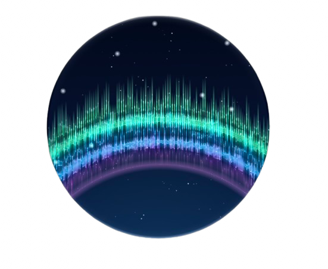
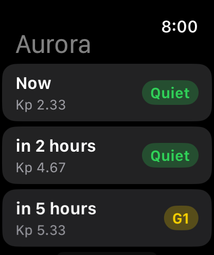
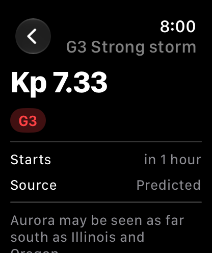
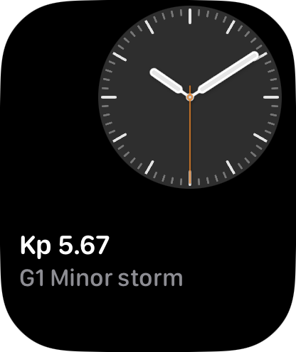
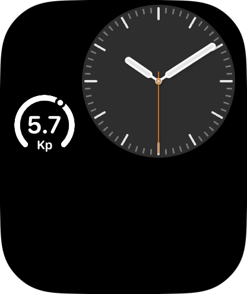
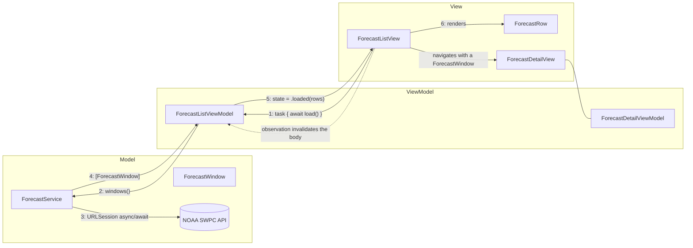

<div align="center">
  
  <h1 style="display: inline-block; vertical-align: middle;">AuroraWatch-MVVM</h1>
</div>

# MVVM (Model-View-ViewModel)

The Model-View-ViewModel pattern as it is actually written in modern SwiftUI, using `@Observable` and structured concurrency. Built as an independent watchOS app.

## MVVM explained

- MVVM splits the app in three roles: `Model`, `View`, and `ViewModel`.
- The `Model` holds the app's data and the rules that data obeys. It knows nothing about the UI and nothing about the screen it will end up on.
- The `View` is a declarative description of the UI for a given state. It owns no logic beyond layout and reading state.
- The `ViewModel` sits between the two. It owns the state of one screen, talks to the model layer, and exposes properties the view can render directly with no branching or computation left to do.
- The key difference from MVC: the `ViewModel` has no reference to the `View`. In MVC the controller reaches out and mutates the view. In MVVM the view model only mutates its own properties, and the view re-renders itself because it was observing those properties.
- That inversion is the whole point. Because nothing in the view model refers to a view, a view model can be created, driven, and asserted against in a plain test with no window, no host controller, and no rendering.
- Communication flows one direction at a time: the `View` calls a method on the `ViewModel`, the `ViewModel` asks the `Model` for data, the `ViewModel` updates its own state, and the observation system re-invalidates the `View`.
- The `Model` and the `View` NEVER directly talk to each other, same as MVC.
- SwiftUI's Observation framework (`@Observable`, `@State`, `@Bindable`) is built around this pattern, which is why MVVM is the default starting point for most SwiftUI apps the way MVC is for UIKit.

## What this project does

A small aurora forecast browser for the wrist, backed by NOAA's Space Weather Prediction Center:

- A list screen showing the next three days of planetary K-index forecast windows, color coded by storm level
- A detail screen for a single window: the Kp value, whether it is observed or predicted, the storm scale it maps to, and a plain English visibility line
- Pull to refresh, Digital Crown scrolling, and an inline error state with a retry action
- A complication and Smart Stack widget showing the current Kp, sharing the same model layer as the app
- Unit tests across the model, formatting, and view model layers, plus UI tests that run against stubbed network data

## Screenshots

| | Screenshot |
|---|---|
| **Forecast list** |  |
| **Window detail** |  |
| **Complication, Smart Stack** |  |
| **Complication, circular gauge** |  |

## Built with

| Tool / Framework | Role |
|---|---|
| Swift 6 | Language, with strict concurrency and main-actor default isolation |
| SwiftUI | UI framework: `NavigationStack`, `List`, `ContentUnavailableView`, `refreshable` |
| Observation | `@Observable` view models, observed by the views with plain `@State` |
| WidgetKit + ClockKit-free complications | Accessory families and the Smart Stack entry, driven by a `TimelineProvider` |
| Foundation | `URLSession` async/await networking, `JSONDecoder`, `Date.FormatStyle` |
| Swift Testing | Unit tests (`@Test`, `#expect`, `confirmation`, parameterized cases) |
| XCTest + XCUIAutomation | UI tests that drive the app in the watch simulator |
| watchOS 27 | Deployment target, independent app with no iOS companion target |
| Xcode 27 | IDE and build system |

No third party dependencies.

## Project structure

```
mvvm/
  AuroraWatch-MVVM Watch App/              the watchOS app target
    AuroraWatch_MVVMApp.swift              app entry point, builds the root scene, picks the service
    AccessibilityIdentifiers.swift         identifier strings the views attach for the UI tests
    Models/
      ForecastWindow.swift                 the value type: time, Kp, observed or predicted
      StormLevel.swift                     Kp to G-scale mapping, the model's own rule
      ForecastService.swift                the protocol, the live implementation, and its errors
    ViewModels/
      ForecastListViewModel.swift          owns list state, loading, refresh, and errors
      ForecastDetailViewModel.swift        owns the presentation of a single window
    Views/
      ForecastListView.swift
      ForecastRow.swift
      ForecastDetailView.swift
      StormLevelBadge.swift
    Formatting/
      ForecastFormatting.swift             Kp, storm level, and relative time strings
    TestSupport/
      UITestForecastStub.swift             DEBUG-only fixture data served during UI test runs
  AuroraWatch-MVVMWidget/                  the complication and Smart Stack target
    AuroraWatchWidget.swift
    ForecastTimelineProvider.swift
  AuroraWatch-MVVM Watch AppTests/         unit tests (Swift Testing)
    ForecastWindowTests.swift
    StormLevelTests.swift
    ForecastServiceTests.swift
    ForecastFormattingTests.swift
    ForecastListViewModelTests.swift
    ForecastDetailViewModelTests.swift
    StubURLProtocol.swift                  a network stub used only by the tests
    FakeForecastService.swift              an in-memory service used to drive the view models
    TestHelpers.swift                      fixtures and clock helpers
  AuroraWatch-MVVM Watch AppUITests/       UI tests (XCTest + XCUIAutomation)
    AuroraWatch_MVVM_Watch_AppUITests.swift
    ScreenshotCaptureUITests.swift         drives the app and captures the README screenshots
  Screenshots/
  README.md
```

## Architecture at a glance



- Solid arrows are the View calling into the ViewModel and the ViewModel driving the Model
- The dotted arrow is the observation system, not a call. Nothing in the view model points back at the view
- The Model and the View never touch each other

## How MVVM is structured here

**Model**
`ForecastWindow` is a plain value type. `StormLevel` owns the Kp to G-scale rule because that rule is true regardless of what is on screen, so it belongs to the model rather than to a view model. `ForecastService` is a protocol with a live `URLSession` implementation behind it. Unlike the MVC project, the model type does not fetch itself: the fetch lives behind a protocol so a view model can be handed a fake. Nothing in the model layer imports SwiftUI.

**View**
`ForecastListView`, `ForecastRow`, `ForecastDetailView`, and `StormLevelBadge`. Views read the view model's already-resolved state and render it. There is no `if kp >= 5` anywhere in a view body. A row is handed a `ForecastRow.Model` with finished strings and a color role, and its job is layout.

**ViewModel**
`ForecastListViewModel` and `ForecastDetailViewModel`. Both are `@Observable` and `@MainActor`. The list view model owns a single `state: ViewState<[ForecastRow.Model]>` enum rather than the usual pile of `isLoading`, `error`, and `items` booleans that can contradict each other. It exposes `load()` and `refresh()`, and it holds the injected `ForecastService`.

```
ForecastListView
  -> .task calls viewModel.load()
  -> ForecastListViewModel calls service.windows()
  -> receives [ForecastWindow]
  -> maps them into row models and sets state = .loaded(rows)
  -> observation re-invalidates the view body

ForecastDetailView
  -> is constructed with a ForecastWindow from the list
  -> ForecastDetailViewModel turns it into finished display strings
```

## How observation works

Observation is how the View finds out that state changed without the ViewModel knowing a View exists. It replaces the delegate callbacks that carry information back and forth in MVC, so it is worth calling out on its own.

- `@Observable` rewrites the view model's stored properties at compile time so each get is recorded and each set is announced
- When SwiftUI evaluates a view's `body`, it records exactly which properties that body read
- When one of those properties is written, SwiftUI invalidates only the views that actually read it, and re-runs their bodies
- The view model never holds a view, a closure back to a view, or a delegate. It sets a property and it is done
- The view owns the view model's lifetime with `@State private var viewModel = ForecastListViewModel(...)`, so the view model survives body re-runs but dies with the screen
- `@Bindable` is the escape hatch for two way binding when a control needs to write back into the view model, for example a toggle

In this project, `ForecastListView` holds its view model in `@State` and reads `viewModel.state` in its body. When `load()` finishes and assigns `.loaded(rows)`, the body re-runs on its own:

```
ForecastListView (View)
  -> .task { await viewModel.load() }
  -> ForecastListViewModel sets state = .loaded(rows)
  -> Observation invalidates ForecastListView
  -> body re-runs and renders the rows
```

This is the same mechanism behind `@Bindable`, `withObservationTracking`, and the widget's own state. It is the main reason MVVM tests read the way they do: you assert on `viewModel.state` directly, because that property is the same thing the view is looking at.

MVVM gets a bad reputation for the opposite reason MVC does. MVC's failure mode is one type doing everything. MVVM's failure mode is ceremony: a view model per view whether or not it has state, protocols wrapping types that have one implementation, and business rules smeared across view models where they get duplicated. That is not a flaw in MVVM itself, it is what happens when the pattern is applied by reflex instead of where state actually lives.

This project avoids that as much as MVVM allows by:

- Giving `StormLevelBadge` and `ForecastRow` no view model at all, since they are pure functions of what they are handed
- Keeping the Kp to storm level rule on the model, so both the app and the widget get it without a view model in between
- Keeping the view models limited to owning screen state, calling the service, and mapping models into display data

Even with that discipline, MVVM has no answer for navigation. The list view still decides what pushes onto the `NavigationStack`, which means navigation logic lives in a view. That dual role is the root cause of the coordinator conversation and is difficult to avoid completely without moving to a pattern that gives navigation its own type, such as MVVM-C.

## When to use MVVM

- SwiftUI screens with real state: loading, empty, error, refresh, and derived display values
- Anywhere the same presentation logic is needed by both an app and a widget or complication
- Teams that want unit coverage on view behavior without rendering anything

## When to avoid it

- Purely presentational views that are already a function of their input, where a view model adds a type and removes nothing
- Flows where navigation, not screen state, is the hard part, since MVVM says nothing about it
- Very large feature graphs where a single central store is easier to reason about than dozens of view models trading state, which is where Redux or TCA style architecture earns its cost

## Testing notes

Every layer is covered, and no test ever touches the live network. Run everything with **⌘U**.

**Unit tests (Swift Testing)**

- **Model** decoding is exercised through a stubbed `URLProtocol`: successful decoding, fractional Kp values, empty responses, server errors, malformed JSON, and the exact URL the service requests. The transport failure case routes through a dead local proxy instead, because a failing `URLProtocol` on current SDKs makes the session retry against the real network
- **Storm level** is parameterized across every Kp boundary, including the G1 edge at exactly 5.0, which is pinned on purpose
- **Formatting** covers the Kp string, the storm descriptor, and `relativeTime`, made deterministic by injecting the reference date and locale rather than reading `Date()`
- **Error copy** for every `ForecastError.message` the error view can display is pinned, so wording changes are deliberate
- **List view model** is built with a `FakeForecastService` and driven through its real `load()`: the happy path, the empty forecast, the error state, that `refresh()` does not flash a spinner over existing content, and that a second `load()` while one is in flight does not double fetch
- **Detail view model** is handed fixture windows and its finished display strings are asserted directly

This is the payoff line against the MVC project. There is no `UIWindow`, no hosting controller, no `viewDidLoad`, and no injection seam bolted onto a view controller just to make it reachable. The view models were already injectable because that is the shape of the pattern, and the view is thin enough that nothing untested lives in it.

**UI tests (XCUIAutomation)**

Five end-to-end flows: list rendering, navigation to detail and back, the storm level badge on a G3 window, the empty state, and the error view with retry. Each launch passes a `UITEST_STUB_SCENARIO` environment value that the app (in DEBUG builds only) uses to serve fixture JSON instead of calling NOAA, so the suite is fast, deterministic, and immune to rate limits.

## Tradeoffs summary

| | |
|---|---|
| Setup speed | Moderate, one extra type per stateful screen |
| Learning curve | Low to moderate, most of it is understanding observation |
| Testability | Excellent for view models and models, views stay thin enough to skip |
| Scalability | Good, until cross screen state starts leaking between view models |
| Apple tooling fit | Natural fit for SwiftUI, Observation was built for this shape |
