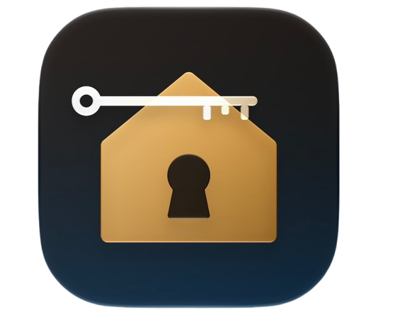
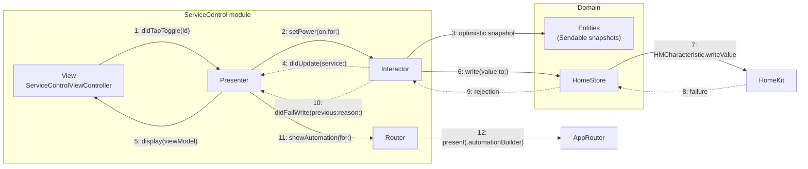

<div align="center">
  
  <h1 style="display: inline-block; vertical-align: middle;">Chatelaine-VIPER</h1>
</div>

# VIPER (View-Interactor-Presenter-Entity-Router)

A five-role module architecture with every boundary declared as a protocol. Built for iPadOS with UIKit, HomeKit, MatterSupport, and ThreadNetwork.

*A chatelaine is the keeper of a household, and the clasp they wore at the waist with every key hanging off it. This app is the same object: one holder, a great many accessories.*

## VIPER explained

- VIPER splits each screen into five roles: `View`, `Interactor`, `Presenter`, `Entity`, and `Router`. A sixth type, the `Builder`, wires them together.
- The `View` is a `UIViewController` with no logic. It renders a view model it is handed and forwards raw user intent. It owns no state and asks no questions.
- The `Interactor` holds the business logic for one use case. It talks to services, applies rules, and emits results. It has no reference to UIKit and no idea a screen exists.
- The `Presenter` is the hub. It receives intent from the View, drives the Interactor, converts results into display-ready view models, and asks the Router to navigate. It is the only stateful type in the module.
- The `Entity` layer is plain data. Entities are owned by the Interactor and never reach the View, which sees only view models built for it.
- The `Router` owns navigation and module assembly. It knows which module comes next and how to present it.
- The distinction that carries the pattern: the Presenter decides *that* we are going somewhere, the Router decides *how that somewhere gets on screen*. Both halves are missing from MVC, and MVVM only supplies the first.
- Every arrow between roles is a protocol. `HomeListViewInput`, `HomeListViewOutput`, `HomeListInteractorInput`, `HomeListInteractorOutput`, `HomeListRouterInput`. Nothing depends on a concrete type across a boundary, which is what makes each role independently substitutable and independently testable.
- The ownership graph is deliberate and worth stating, because getting it wrong is the most common way VIPER leaks: the View holds the Presenter strongly, the Presenter holds the Interactor and Router strongly, the Interactor holds its output (the Presenter) weakly, and the Router holds its view controller weakly. Any other shape retains a module forever.

## Why VIPER earns its keep on HomeKit

On most iOS apps VIPER is a hard sell. Five types and three protocol groups to show a list of strings is ceremony, and everyone can see it is ceremony.

HomeKit removes that argument in two places at once, which is unusual. Most domains give you an Interactor argument *or* a Router argument. This one gives you both.

**The Interactor argument: HomeKit is not a data source, it is a live object graph that mutates underneath you.**

- `HMHome`, `HMAccessory`, `HMService`, and `HMCharacteristic` are reference types that are not `Sendable`, and their delegate callbacks arrive on the main queue.
- An `HMAccessory` you are holding will change its own state and notify you afterward. Nothing is a snapshot unless you make it one.
- Reads and writes are asynchronous and failable, and a failed write leaves the on-screen value ahead of reality.
- Characteristic *metadata* — format, minimum, maximum, step, units, valid values — is what tells you whether a control is a switch, a slider, a stepper, or a read-only label. The UI has to be generated from that metadata, because hardcoding it per accessory type is a bet against every accessory you have not seen.

Converting all of that into immutable value snapshots is real work with real rules, and it belongs to exactly one role. That is the Interactor, and the `Entity` layer is the value type it produces. Under Swift 6 strict concurrency the boundary stops being stylistic: the View is physically unable to hold a `HMAccessory`, because what crosses to it is `Sendable` and HomeKit is not.

**The Router argument: navigation here is four levels deep, width-dependent, and sometimes started by the system.**

- Homes, rooms, accessories, services. On a regular-width iPad that is a three-column `UISplitViewController`; on compact width it is a push stack. The same selection means two different things.
- The automation builder is a modal flow with its own internal navigation that can be entered from three different places.
- Matter commissioning hands control to an out-of-process system UI and returns later, possibly after the app has been suspended.
- An App Intent can launch the app cold and demand that a specific accessory is on screen in the correct column, with the two columns behind it populated.

No view controller has the vantage point to decide any of that. This project puts all of it behind `AppRouter` and a per-module `Router`, and every view controller stays a renderer of what it was given.

## What this project does

An iPad controller for a HomeKit household, built against the HomeKit Accessory Simulator so it runs on any machine with no smart home hardware:

- A **three-column split view**: homes and zones in the sidebar, rooms and their accessories in the supplementary column, the selected accessory's services in the detail column
- **Generated controls**, where every switch, slider, stepper, and picker is derived from `HMCharacteristicMetadata` rather than from a hardcoded list of accessory types
- **Optimistic writes with rollback**, so a tapped switch moves immediately and returns to its previous value with an inline reason if HomeKit rejects the write
- An **automation builder** covering timer triggers, characteristic events, threshold ranges, significant time events, presence, and duration, including the event-versus-condition distinction that HomeKit models as two separate things
- **Matter commissioning** through `MatterSupport` and an out-of-process extension, with Thread credentials fetched from `ThreadNetwork`
- **App Intents** exposing scene activation and accessory power to Siri and Shortcuts, as a second, system-initiated entry point into the same Router

## The domain

HomeKit's object model looks like a folder tree for about ten minutes, and then it stops being one. The parts below are the parts that made this app worth building rather than, say, a list of files.

**The hierarchy**

| Level | Type | What it is |
|---|---|---|
| Account | `HMHomeManager` | Every home the user has access to, plus the authorization status |
| Home | `HMHome` | One dwelling. Owns rooms, zones, accessories, scenes, triggers, and users |
| Room | `HMRoom` | A named space. An accessory belongs to exactly one |
| Zone | `HMZone` | A grouping of rooms, and rooms may be in several. Not a level, a cross-cut |
| Accessory | `HMAccessory` | One physical device, or one endpoint behind a bridge |
| Service | `HMService` | One capability of that device: a light, a fan, a temperature sensor |
| Characteristic | `HMCharacteristic` | One readable or writable value: power, brightness, hue, target temperature |

**The parts that carry the complexity**

These five are the reason there is a mapping layer at all, and the reason it has tests:

- **The tree is not a tree.** Accessories nest inside rooms, but zones cut across rooms, service groups cut across accessories, and a service can *link* other services to say "these belong to the same physical fixture." A fan with a light in the same ceiling unit is one accessory, two services, one link. Rendering that as a folder tree loses the relationship the user actually cares about.
- **Metadata is the interface.** A characteristic's format, bounds, step, units, and valid-value set are the only honest source for what control to draw. A brightness characteristic with a step of 10 wants a stepper, not a continuous slider, and nothing but the metadata will tell you that.
- **Reachability is not existence.** An accessory can be present in the home and unreachable. Bridged accessories go unreachable *together*, because the bridge went down, and showing twelve identical warnings when one bridge is offline is a failure of the model layer, not the UI.
- **Notifications are opt-in and are not free.** Live values only arrive if you call `enableNotification` on each characteristic you care about, and leaving them enabled for every characteristic on every accessory costs battery on the accessory itself. Deciding what to subscribe to as screens appear and disappear is a genuine policy, and it lives in the Interactor.
- **Events and conditions are different things.** An `HMEventTrigger` fires on an event and then evaluates a predicate. "When the door opens" is the event; "only after sunset" is the predicate. Users describe both as *when*, and the builder has to sort one from the other before it can construct anything valid.

**The trigger types the builder supports**

| Trigger | Fires on |
|---|---|
| `HMTimerTrigger` | A fixed date, optionally repeating on an interval |
| `HMCharacteristicEvent` | A characteristic reaching a specific value |
| `HMCharacteristicThresholdRangeEvent` | A value entering or leaving a numeric range |
| `HMSignificantTimeEvent` | Sunrise or sunset, plus or minus an offset |
| `HMPresenceEvent` | The first person arriving, or the last person leaving |
| `HMDurationEvent` | A state having persisted for a set duration |

Every trigger owns one or more `HMActionSet`s, which hold `HMCharacteristicWriteAction`s. Composing a valid trigger means assembling an event, an optional predicate, and at least one non-empty action set, and rejecting the many combinations HomeKit will accept at construction and then silently never fire. That validation is pure, deterministic, and free of both UIKit and HomeKit, which is exactly the kind of logic an Interactor should be holding.

## Screenshots

| | Sidebar and rooms | Accessory detail |
|---|---|---|
| **Three-column split view** |  |  |

| | Generated controls | Write failure rollback |
|---|---|---|
| **Characteristic control** |  |  |

| | Event and condition | Action set |
|---|---|---|
| **Automation builder** |  |  |

## Built with

| Tool / Framework | Role |
|---|---|
| Swift 6 | Language, with strict concurrency and main-actor default isolation |
| UIKit | `UISplitViewController` in triple-column mode, compositional layout, diffable data sources |
| HomeKit | The entire domain: homes, rooms, accessories, services, characteristics, triggers |
| MatterSupport | Matter device commissioning through an out-of-process extension |
| ThreadNetwork | Thread credential retrieval for border router handoff during commissioning |
| App Intents | Scene and accessory control from Siri and Shortcuts, as a second entry point |
| Swift Testing | Unit tests (`@Test`, `#expect`, parameterized cases) |
| XCTest + XCUIAutomation | UI tests that drive the app in the simulator |
| HomeKit Accessory Simulator | Fixture accessories, so the project runs with no hardware |
| iPadOS 27 | Deployment target |
| Xcode 27 | IDE and build system |

No third party dependencies. No Combine and no Observation either, which is deliberate: VIPER's boundaries are protocols with explicit input and output halves, and reaching for a publisher or an `@Observable` would quietly collapse two of the five roles into one.

## Running it

HomeKit needs a paired accessory to be interesting, so this project is built against Apple's simulator rather than hardware:

1. Download **Additional Tools for Xcode** from the Apple developer downloads page and open **HomeKit Accessory Simulator**
2. Add a few accessories, or import `Fixtures/chatelaine-household.json` to get the exact household the screenshots use
3. Run the app on the iOS Simulator on the same Mac, and accept the HomeKit permission prompt
4. Run the tests with **⌘U**, none of which require the simulator, a device, or a network

The app target needs the HomeKit capability and an `NSHomeKitUsageDescription` string, both of which are already in the checked-in project. Matter commissioning additionally needs the Matter Allow Setup Payload entitlement, and that path degrades to a clear unavailable state rather than crashing if the entitlement is missing.

## Project structure

```
viper/
  Chatelaine-VIPER/                        the app target
    App/
      AppDelegate.swift
      SceneDelegate.swift                  builds the split view and the AppRouter, nothing else
      AccessibilityIdentifiers.swift       identifier strings shared by the views and the tests
    Entities/
      HomeSnapshot.swift                   Sendable value types, one per HomeKit level
      RoomSnapshot.swift
      AccessorySnapshot.swift
      ServiceSnapshot.swift
      CharacteristicSnapshot.swift
      CharacteristicValue.swift            the closed enum HomeKit's Any-typed value is not
      ControlKind.swift                    toggle, slider, stepper, picker, readout
      Reachability.swift                   reachable, unreachable, unreachableViaBridge(id)
      AutomationDraft.swift                an automation being built, valid or not yet
      TriggerCondition.swift               the event and predicate halves, kept apart
    Services/
      HomeStore.swift                      the only type in the project that imports HomeKit
      HomeStoreProviding.swift             the protocol seam every Interactor depends on
      CharacteristicWriting.swift
      TriggerWriting.swift
      AccessoryCommissioning.swift         MatterSupport and ThreadNetwork behind one protocol
      NotificationPolicy.swift             which characteristics stay subscribed, and when
      Mapping/
        AccessoryMapper.swift              HMAccessory -> AccessorySnapshot
        CharacteristicMapper.swift         HMCharacteristicMetadata -> ControlKind
        TriggerMapper.swift                HMTrigger <-> AutomationDraft, both directions
    Modules/
      HomeList/                            one module, fully expanded
        HomeListContract.swift             all five protocols for this module, in one file
        HomeListViewController.swift
        HomeListPresenter.swift
        HomeListInteractor.swift
        HomeListRouter.swift
        HomeListBuilder.swift              assembles the five and returns a UIViewController
        HomeListViewModel.swift            what the View is allowed to see
      RoomList/                            same seven files
      AccessoryDetail/                     same seven files
      ServiceControl/                      same seven files
      AutomationList/                      same seven files
      AutomationBuilder/                   same seven files
      AccessorySetup/                      same seven files
    Navigation/
      AppRouter.swift                      owns the three columns and the compact-width fallback
      Route.swift                          the enumerated destinations this app can be in
      SplitViewPresenting.swift            a protocol over UISplitViewController
      DeepLink.swift                       parses an App Intent or URL into a Route
    Intents/
      ActivateSceneIntent.swift
      SetAccessoryPowerIntent.swift
      ChatelaineShortcuts.swift            AppShortcutsProvider
  ChatelaineMatterExtension/               the out-of-process commissioning extension
    MatterExtensionRequestHandler.swift
  Chatelaine-VIPERTests/                   unit tests (Swift Testing)
    CharacteristicMapperTests.swift
    AccessoryMapperTests.swift
    TriggerValidationTests.swift
    ServiceControlInteractorTests.swift
    AccessoryDetailPresenterTests.swift
    AppRouterTests.swift
    ScriptedHomeStore.swift                a HomeStoreProviding that replays a fixture household
    SpyViewInput.swift                     records what the Presenter told the View to render
    SpyRouter.swift                        records navigation instead of performing it
    SpySplitViewPresenter.swift
    TestHelpers.swift                      household fixtures and metadata builders
  Chatelaine-VIPERUITests/                 UI tests (XCTest + XCUIAutomation)
    Chatelaine_VIPERUITests.swift
  Fixtures/
    chatelaine-household.json              importable into HomeKit Accessory Simulator
  Screenshots/
  README.md
```

## Architecture at a glance



- Solid arrows are calls made through an `Input` protocol: someone is being told to do something
- Dotted arrows are results returned through an `Output` protocol: the callee reports what happened and never learns who is listening
- Entities stop at the Presenter. Step 5 carries a view model, not an `AccessorySnapshot`, and never an `HMService`
- The View never sees steps 2 through 4, 6 through 10, or 12

## How VIPER is structured here

**Entity**
Every HomeKit reference type has a `Sendable` struct counterpart, produced by the mappers and owned by the Interactors. `CharacteristicValue` is the one worth calling out: HomeKit hands you `Any?`, and this project closes it into an enum over bool, int, double, string, and data at the mapping boundary so that nothing above it ever writes a conditional cast. `Reachability` is likewise an enum rather than a `Bool`, because `.unreachableViaBridge(HMAccessory.ID)` is the case that lets the Presenter collapse twelve warnings into one.

**Interactor**
`ServiceControlInteractor` holds the optimistic write policy: apply the new value to its snapshot, report it upward immediately, issue the write, and on rejection report the previous value along with a reason. It also owns the notification policy, enabling characteristic notifications when a module appears and disabling them when it goes away. It imports neither UIKit nor HomeKit. Its only dependencies are `HomeStoreProviding` and `CharacteristicWriting`, both injected by the Builder.

**Presenter**
`ServiceControlPresenter` is the only stateful object in the module. It holds the current snapshot, converts it into a `ServiceControlViewModel` of already-formatted strings and already-chosen control kinds, and decides when navigation should happen. It never formats a value the View could have formatted differently, and it never calls a navigation API.

**View**
`ServiceControlViewController` is a `UICollectionViewController` over a compositional layout, driven entirely by `display(_ viewModel:)`. It has no `if` on accessory type, no number formatter, no reference to any entity, and no knowledge that HomeKit exists. Its whole job is to bind a view model to cells and to call back with the identifier of whatever was touched.

**Router**
`ServiceControlRouter` knows which modules can be reached from this one and calls their Builders. It does not know how they will be presented, because that is width-dependent and belongs to `AppRouter`, which owns the split view and resolves `.accessory(id)` into either a supplementary-column replacement or a push depending on the current size class.

```
ServiceControlViewController
  -> user drags the brightness slider
  -> ServiceControlPresenter.didChangeValue(0.4, for: characteristicID)
  -> ServiceControlInteractor applies it optimistically and reports upward
  -> Presenter rebuilds the view model, the slider stays where the finger left it
  -> Interactor's write is rejected: accessory unreachable
  -> Presenter rebuilds again with the old value and an inline reason
  -> The view controller has rendered three times and decided nothing
```

## How the Router works across columns

This is the part with no equivalent in the MVC or MVP projects, so it is worth walking through on its own.

- A `Route` enum lists everything this app can be showing: `.homes`, `.home(HomeSnapshot.ID)`, `.room(RoomSnapshot.ID)`, `.accessory(AccessorySnapshot.ID)`, `.automationBuilder(AutomationDraft.ID)`, `.setup`. It is data, not behavior.
- `AppRouter` is created once in `SceneDelegate` and holds a `SplitViewPresenting` dependency. It is the single source of truth for what is on screen in which column.
- The same route means different things at different widths. On regular width, `.accessory(id)` fills the secondary column and leaves the sidebar and supplementary column intact. On compact width the split view has collapsed into a navigation stack and the same route is a push. One method resolves that once, rather than every module resolving it separately and inconsistently.
- Module Routers depend on `AppRouter` through a narrow protocol and can only express intent (`present(.automationBuilder(draft))`). They cannot reach a `UINavigationController` and cannot ask about size classes.
- Deep links are where this pays. An App Intent invoking `SetAccessoryPowerIntent` can launch the app from cold directly into `.accessory(id)`, and the Router has to reconstruct the two columns behind it — the correct home in the sidebar, the correct room in the supplementary column — before the detail column is valid. A view controller cannot do this, because at that moment none of the three exist yet.
- Matter commissioning suspends the app, hands off to system UI, and returns with a result later. `AppRouter` owns the pending `SetupTicket` and resolves it on return, including the case where the user has navigated somewhere else entirely in the meantime.

```
Siri: "turn on the hall lamp"
  -> SetAccessoryPowerIntent resolves the accessory
  -> DeepLink -> Route.accessory(id)
  -> AppRouter builds sidebar, supplementary, and secondary columns in order
  -> ServiceControl module appears already showing the result of the write
  -> No view controller in the chain knew it was launched by Siri
```

VIPER's cost is real and worth naming plainly: this project has seven files per module against MVVM-C's four types per screen, and six modules means forty-two files exist before a single accessory renders. Tracing one slider drag touches four types and three protocols. What that buys is that every one of those four types can be replaced by a test double at its boundary, and that a domain which is asynchronous, failable, mutating, and delegate-driven never reaches a view controller in that state. On a household of twelve accessories that is a bad trade. On a domain where the model layer is the hard part, it is the right one.

## When to use VIPER

- Domains where the hard problem is below the UI: live object graphs, failable writes, subscription policy, or anything the framework hands you in a shape you cannot show a user
- Large teams, where a fixed file-per-role template means any engineer can open any module and know where a given line lives
- Codebases where modules are moved, reused, or feature-flagged between flows, since a module with protocol boundaries on all sides can be lifted wholesale
- Screens that repeat a shape many times with different data, where the template's cost is paid once and the benefit is paid per screen
- Code that has to be testable without a device, which HomeKit, HealthKit, and CoreBluetooth apps all need and none of them get for free

## When to avoid it

- SwiftUI. VIPER's View is a passive object that gets told what to render, and SwiftUI's View is a value that recomputes itself from state. The two disagree about who is in charge, and every attempt to reconcile them ends in a `Presenter` that is really a ViewModel and three unused protocols
- Small apps, prototypes, and anything with fewer than about five screens, where the template is pure overhead
- Screens with genuinely trivial logic, where the Interactor exists only to forward one call and is a lie by the second sprint
- Teams that will not hold the line on entities stopping at the Presenter, since a `HMAccessory` reaching a view controller once undoes the entire argument for the boundary

## Testing notes

Every layer is covered, and nothing in the suite requires a device, a network, an accessory, or the HomeKit Accessory Simulator. Run everything with **⌘U**.

**Unit tests (Swift Testing)**

- **Characteristic mapping**: the highest-value suite in the project. Parameterized over format, bounds, step, units, and valid-value combinations, asserting the resulting `ControlKind`. Covers a step of 10 producing a stepper rather than a slider, a write-only characteristic with no read permission producing no readout, an enumerated valid-value set producing a picker, and unknown formats degrading to a readout rather than to a crash.
- **Accessory mapping**: bridged accessories collapsing into a single `.unreachableViaBridge` reason, linked services staying grouped, and a service group spanning two accessories surviving the trip into value types.
- **Trigger validation**: the event-versus-predicate split, an inverted threshold range being rejected, an event trigger with an empty action set being rejected, and a significant time event with an offset beyond the legal window being clamped rather than accepted.
- **ServiceControl interactor**: built with a `ScriptedHomeStore` and a failing `CharacteristicWriting`, asserting that an optimistic value is reported before the write is issued, that a rejection reports the *previous* value and not a default, and that two writes to the same characteristic in flight resolve in order.
- **AccessoryDetail presenter**: built with a `SpyViewInput`, asserting exactly what the View was told to render and, just as importantly, that it was never handed an entity.
- **AppRouter**: built with a `SpySplitViewPresenter`, then driven through the same route requests the module Routers make. Asserts that `.accessory(id)` replaces the secondary column at regular width and pushes at compact width, that a cold deep link from an App Intent populates all three columns in order, and that a Matter commissioning result returning after the user has navigated away is discarded rather than applied to the wrong screen.

That last suite is the payoff. In the MVC project, navigation is a `pushViewController` call buried in a delegate method and is only reachable through a UI test. Here the entire column-resolution policy, including the cold-launch deep link, is a method on a plain object with an injected dependency, and it runs in milliseconds.

**UI tests (XCUIAutomation)**

Five end-to-end flows: selecting through all three columns, toggling a characteristic and seeing a rejected write roll back, building and saving a threshold-range automation, entering the setup flow and cancelling out of it, and rotating from regular to compact width without losing the selected accessory. Each launch passes a `UITEST_SCENARIO` environment value that the app, in DEBUG builds only, uses to substitute the `ScriptedHomeStore` for the real one, so no test depends on HomeKit permission, the accessory simulator, or a write actually succeeding.

## Tradeoffs summary

| | |
|---|---|
| Setup speed | Very slow, seven files and five protocols before the first cell renders |
| Learning curve | Steep, and the ownership graph is easy to get subtly wrong |
| Boilerplate | The highest of any pattern in this repository, by a wide margin |
| Testability | Excellent, and uniquely so at the module boundaries |
| Scalability | Excellent, the per-module cost is fixed and the template does not degrade |
| Apple tooling fit | Poor with SwiftUI, natural with UIKit, and unusually well matched to delegate-driven frameworks like HomeKit |
